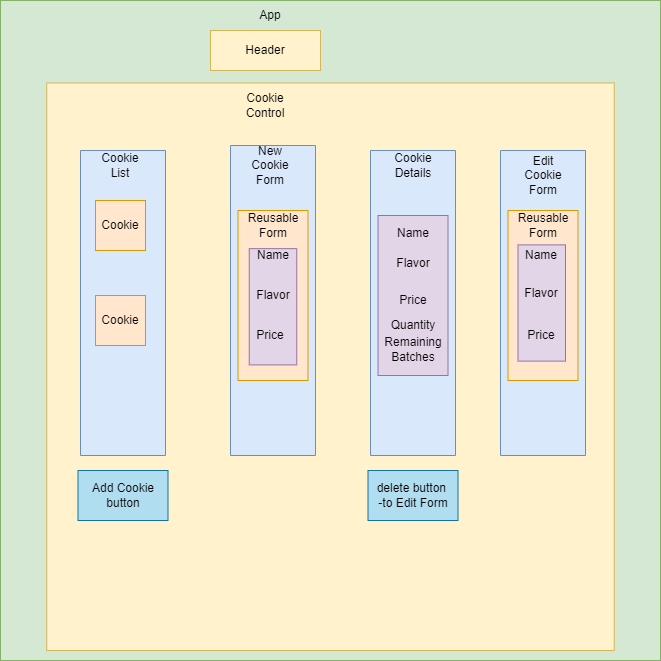

  

# Erika's Cookie Store

#### By: Erika Mogollon

## Description
 This web application exaplores create-react-app, JSX, props, and components. Using full CRUD functionality, this app has a list of different batches of cookies in which users can add ot purchase them.

### Technologies Used

* JavaScript
* React
* JSX
* Git
* HTML

### Setup/Installation Requirements

* Clone or download this repository onto your desktop. 'https://github.com/emogo16/erikas-cookie-store.git'
* Open VScode
* In terminal run:
* `npm install`
* `npm run start`

### Known Bugs

* There is no known bugs at the moment.

### Contact

* Erika Mogollon or 'fany200025@hotmail.com'

### License

MIT

https://en.wikipedia.org/wiki/MIT_License

Copyright (c) 1/13/2022 Erika Estefania Mogollon
